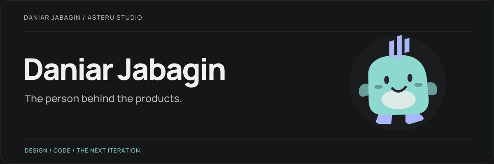
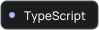
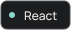
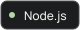
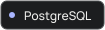
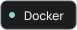

<picture>
  <source media="(prefers-reduced-motion: reduce)" srcset="assets/header.png">
  
</picture>

  
  
  

<h2 align="center">Hi, I’m Daniar.</h2>

  Developer from Kazakhstan. The person behind <strong>Asteru Studio</strong>. 
  I design, build, and keep improving my own products.

 

<table>
  <tr>
    <td width="50%" valign="top">
      <h3>01 &nbsp; What I build</h3>
      
Web products, interfaces, and the systems behind them.

      
<strong>From the first sketch to the next release.</strong>

    </td>
    <td width="50%" valign="top">
      <h3>02 &nbsp; What I care about</h3>
      
Clear design, fast interactions, and code that stays readable.

      
<strong>Useful first. Better with each iteration.</strong>

    </td>
  </tr>
</table>

## On my workbench

**Asteru Studio** is where I’m turning my own ideas into products. 
Early demos, small experiments, and progress go into the studio journal.

  

## Tools I reach for

  
  
  
  
  
  

<strong>More of the toolbox</strong>

| Interfaces   | Backend & data          | Delivery & experiments           |
| :----------- | :---------------------- | :------------------------------- |
| Tailwind CSS | NestJS · Redis · Prisma | Traefik · GitHub Actions · Godot |

 

<strong>Have an idea we could build together?</strong>

  

---

I write the code at Asteru. It makes its own decisions.

